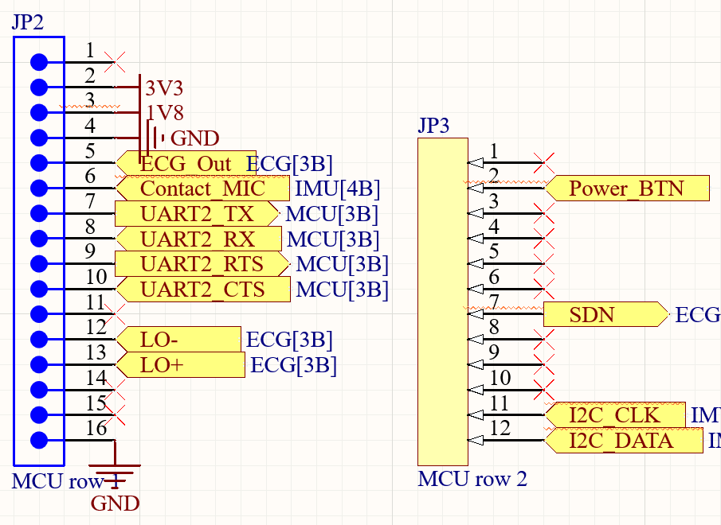
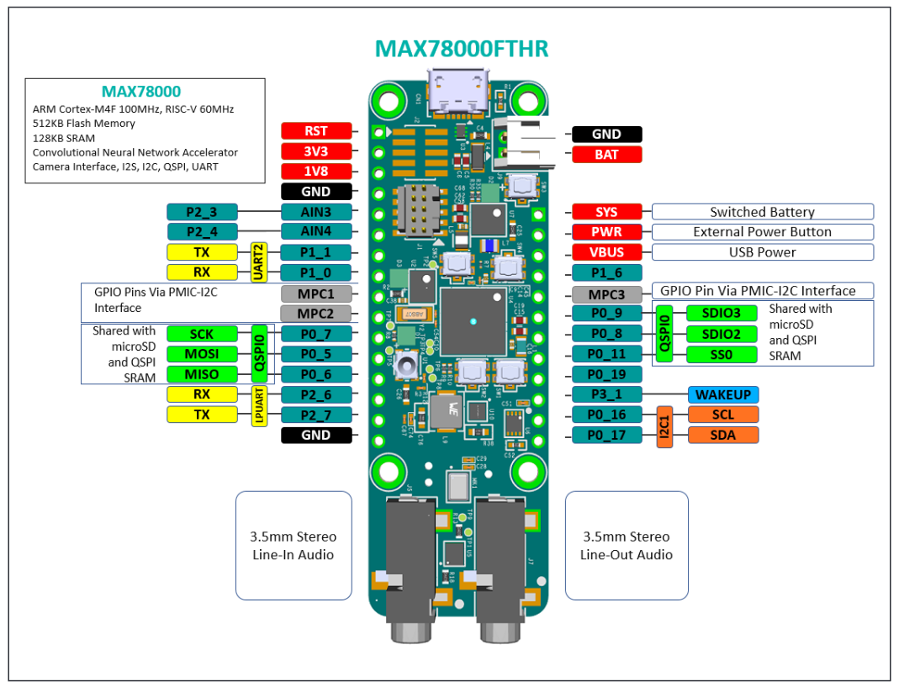

## Description

Main program for device with DEMO mode for automatic startup. If you do not wish to start in DEMO mode comment out the #define in main.c. For a list of commands type "help" on the CLI.

Universal instructions on building, flashing, and debugging this project can be found in the **[MSDK User Guide](https://analog-devices-msdk.github.io/msdk/USERGUIDE/)**.

## Hardware
Ensure all sensors are hooked up properly and all relevant GPIO are correctly set. 



### Pin Description
* ECG output goes to AIN3
* Contact mic output goes to AIN4
* All UART2 pins are for adafruit ble device (note: Hardware flow control is currently not configured)
* LO- is for leads off detection of black ecg lead
* LO+ is for the blue ecg lead

### Sensor Hookup
If using adafruit development board hookup information is available from **[Sparkfun](https://learn.sparkfun.com/tutorials/ad8232-heart-rate-monitor-hookup-guide)**
**If using custom sensor pcb, make sure SDN is pulled high to turn the ECG on.**

Contact microphone goes on skin to pick up movement/vibrations.

## Terminal Debugging

To connect to the CLI, open putty or any other serial monitor and connect to the desired COM port using 115200 baud.


### Expected Output

The Console UART of the device will output these messages:

```
-=- MAX78000 FreeRTOS (V10.2.0) Demo -=-
SystemCoreClock = 60000000
Starting scheduler.
Uptime is 0x00000000 (0 seconds), tickless-idle is disabled

Enter 'help' to view a list of available commands.
cmd>
```
