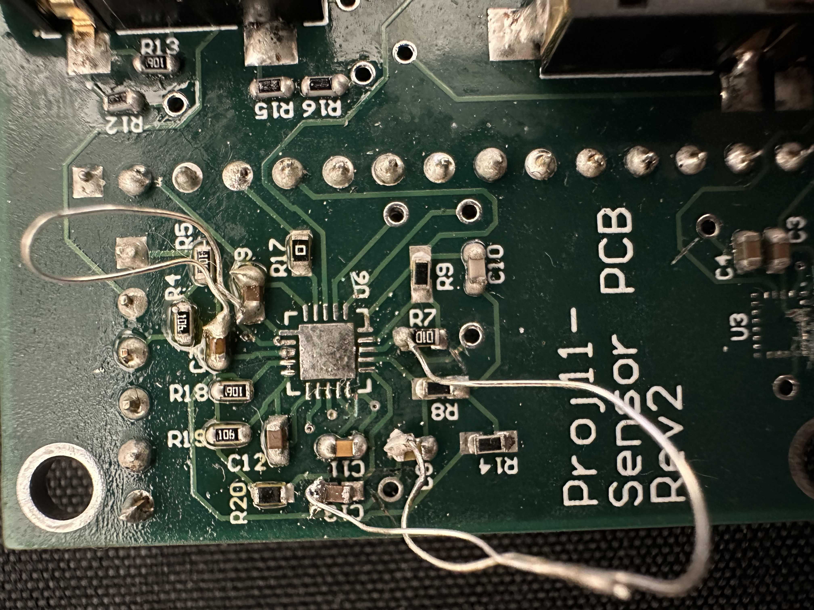

## Description

This directory holds all files related to the sensor PCB development.

 PCB3 is the most recent board used for the final Spr 2024 demo.
 
 
 ## **!!!WARNING!!!** 
 There are PCB errors with the ECG section of the board. REFOUT was shorted to ground in the design, but this was an error. If using existing PCBs certain traces will need to be cut to separate REFOUT and Ground. 

 ### Cut traces & jumpers
* C13_2 should be connected to REFOUT
* C8_1 should be connected to REFOUT
* R7_2 should be connected to REFOUT
* AD8232 trace on pin8 should be cut to separate REFOUT from ground
* C9_2 needs to be reconnected to GROUND after pin 8 is cut
* ALL VIAS connected to these traces/pins should be disconnected as well

### Picture Example
